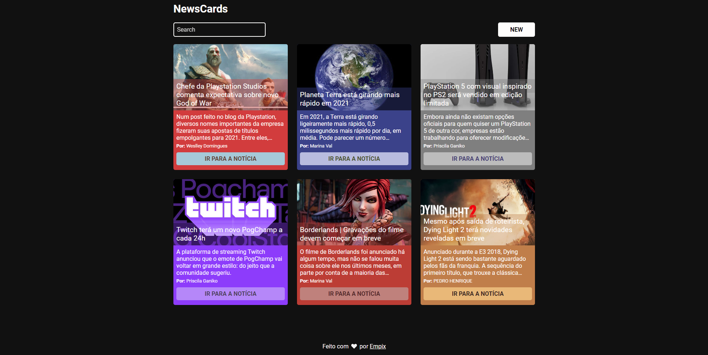
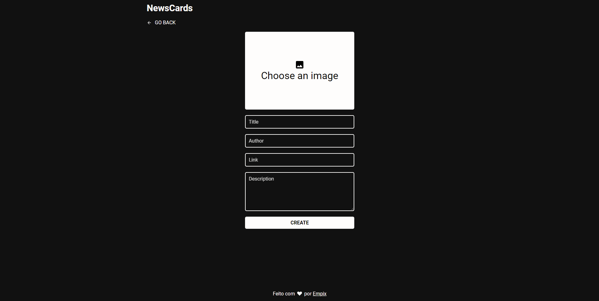

# NewsCards-frontend




### Techs

- React
- Axios

### Starting

- Clone o repositório

```
git clone https://github.com/Empix/newscards-frontend.git
```

- Instale as dependências

```
yarn
```

- Configure o api.js com a url da api

- Inicie

```
yarn start
```
